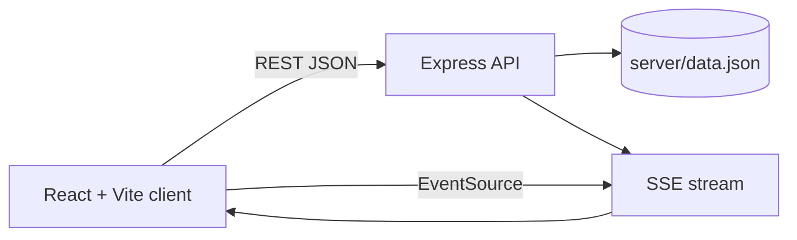

# GatherLive architecture

## Runtime shape

The browser owns presentation state only. The API owns event data, RSVP transitions, counts, capacity enforcement, and announcement writes. After a successful RSVP, the API broadcasts the canonical event snapshot to every connected dashboard through Server-Sent Events.

## Core data model

- `events`: organizer-owned event metadata and denormalized live counters.
- `rsvps`: one record per `(eventId, attendeeId)`; updates replace the existing status.
- `announcements`: event updates visible to the organizer dashboard and ready to be extended into attendee notifications.

For a cloud deployment, replace `data.json` with Firestore or PostgreSQL. In PostgreSQL, enforce `UNIQUE (event_id, attendee_id)` and perform capacity checks in a transaction with a row lock. In Firestore, use a transaction around the event counter and RSVP document.

## Security boundary

The demo uses synthetic IDs and a role switch so it can run without credentials. A production adapter should add Firebase Auth or Supabase Auth, verify a bearer token in middleware, and enforce organizer ownership before event mutations. Counts are never accepted from the browser; the server derives them from the stored transition.

## Scale path

1. Static React assets deploy to Firebase Hosting, Cloudflare Pages, or Vercel.
2. Express deploys to Render, Railway, Fly.io, Cloud Run, or a serverless HTTP runtime.
3. Managed PostgreSQL/Firestore becomes the source of truth.
4. Redis or a managed pub/sub service fans updates across multiple API instances.
5. A queue handles reminders, email, push notifications, exports, and analytics jobs.
6. CDN caching serves public event pages while authenticated writes remain on the API.
